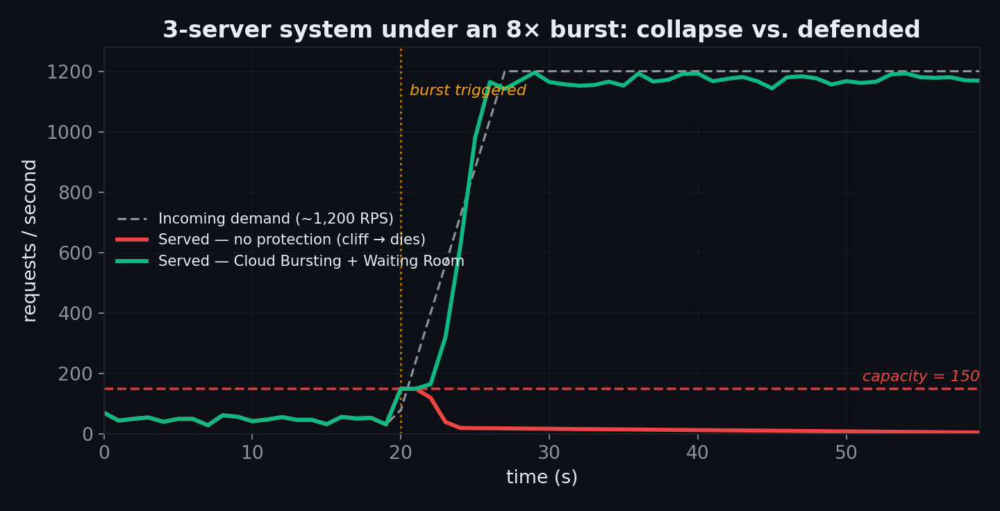
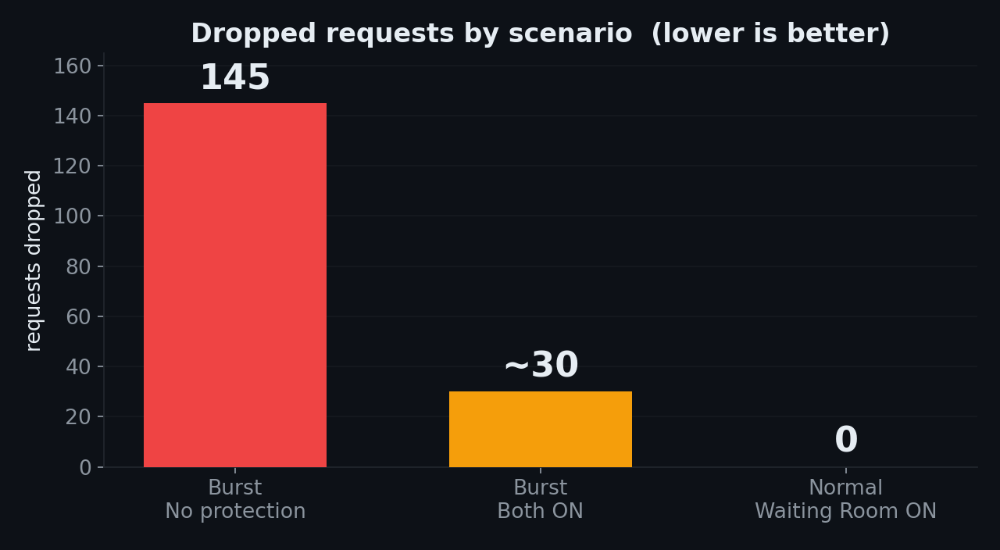
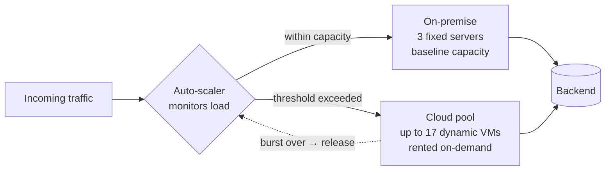
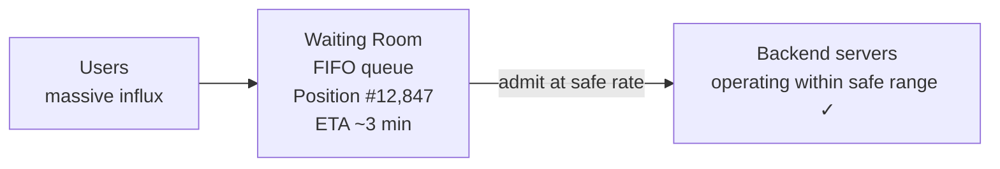

# ⚡ Managing Bursty Traffic in Event-Driven Systems

> **Computer Networks · Group 3 — High-Throughput**
> A study of how modern services survive sudden 10–100× traffic spikes, combining **Hybrid Cloud Bursting** (scale the supply) and **Virtual Waiting Rooms** (smooth the demand), validated with a live 3-server load simulation.

**Authors:** 강성욱 · 심규상 · 이윤서 · 하헌철

### 🎥 Presentation & Live Demo Video

**▶️ Watch here: https://youtu.be/_B1sQEoNUAo**

### 🕹️ Try the Live Demo

**👉 Run the simulation yourself: https://bursty-traffic-demo.onrender.com/**

Toggle Cloud Bursting and the Virtual Waiting Room on/off, hit **🎫 티켓 오픈!** to trigger the burst, and watch the real-time RPS curve react.

> ⏳ *Hosted on Render's free tier — the first request may take 30–60s while the instance wakes from sleep. Give it a moment.*

---

## Table of Contents

1. [TL;DR](#tldr)
2. [Motivation — Bursty ≠ Rare](#1-motivation--bursty--rare)
3. [The Problem — The Provisioning Dilemma](#2-the-problem--the-provisioning-dilemma)
4. [The Experiment — Crushing a 3-Server System](#3-the-experiment--crushing-a-3-server-system)
5. [Results — Three Scenarios, Side by Side](#4-results--three-scenarios-side-by-side)
6. [Solution A — Hybrid Cloud Bursting](#5-solution-a--hybrid-cloud-bursting)
7. [Solution B — Virtual Waiting Room](#6-solution-b--virtual-waiting-room)
8. [Why Drops Still Happen Under Extreme Bursts](#7-why-drops-still-happen-under-extreme-bursts)
9. [Why the Waiting Room Hits 0 Drops Under Normal Load](#8-why-the-waiting-room-hits-0-drops-under-normal-load)
10. [Which Strategy, and When?](#9-which-strategy-and-when)
11. [Real-World Deployments](#10-real-world-deployments)
12. [Key Takeaways](#key-takeaways)
13. [Repository Structure](#repository-structure)
14. [References](#references)

---

## TL;DR

Bursty workloads — ticketing, course registration, live-commerce flash drops, game launches — sit idle for hours, then spike 10–100× within seconds. Provisioning statically for the peak wastes ~95% of capacity in idle hours; provisioning for the average drops ~90% of users at peak. Neither is acceptable.

Two complementary defenses solve this:

- **Cloud Bursting** expands the *supply* side — rent cloud capacity on demand, release it after the burst.
- **Virtual Waiting Room** smooths the *demand* side — queue excess users and admit them at a rate the backend can absorb.

In our simulation, a 3-server system (≈150 RPS capacity) hit with a ~1,200 RPS burst (8× capacity) dropped **145 RPS** with no protection. With both defenses on, drops fell to **~30**, and under normal load the waiting room held drops at **0**. Defense isn't perfect under extreme bursts — but it turns a total outage into a minor inconvenience.

---

## 1. Motivation — Bursty ≠ Rare

Not all high-throughput traffic looks the same.

| | Constant Throughput | Bursty Traffic |
|---|---|---|
| **Examples** | YouTube, Netflix, Twitch | Concert tickets, course registration, K-pop live drops |
| **Load profile** | High but stable all day | Idle for hours, then 10–100× spike in seconds |
| **Variance** | Low · predictable | High · unpredictable peaks |
| **Capacity planning** | Straightforward | The whole problem |

Bursty workloads are now everywhere:

- **Ticketing** — concerts and sports events sell out in seconds.
- **Course registration** — every student in a university hits *enroll* the same minute.
- **Live-commerce** — limited-stock flash drops on home-shopping streams.
- **Game launches** — day-one logins overwhelm authentication servers.

> **Designing for the peak is now a core requirement — not an optional optimization.**

---

## 2. The Problem — The Provisioning Dilemma

If demand spikes 100× for ten minutes per month, how many servers do you buy? With *static* capacity, both answers are bad.

| Strategy | Headline number | Pros | Cons |
|---|---|---|---|
| **Provision for the PEAK** | ~95% of capacity sits idle | Survives the spike | Servers idle most of the time · massive operating cost · *still* risky if the peak is underestimated |
| **Provision for the AVERAGE** | ~90% of users dropped at peak | Cheap during normal hours | Service collapses during bursts · brand damage · lost revenue |

The root issue: a *fixed* capacity ceiling cannot match a *variable* demand curve. You either pay for capacity you rarely use, or you fail exactly when it matters most. The solutions below break the fixed-ceiling assumption from two different directions.

---

## 3. The Experiment — Crushing a 3-Server System

We built a small simulation to make the failure mode visible rather than theoretical.

| Parameter | Value |
|---|---|
| Fixed servers | 3 on-prem (S1, S2, S3) |
| Capacity | ~150 req/second |
| Normal traffic | ~25–80 req/second |
| Burst traffic | ~1,000–1,200 req/second |
| Headroom at peak | **8× over capacity** |

Under normal traffic the real-time RPS curve stays comfortably below the `capacity = 150` line. Then we trigger the burst (the "🎫 티켓 오픈!" event) and watch what happens. You can reproduce all of this yourself in the [live demo](https://bursty-traffic-demo.onrender.com/).

**What happens with no protection:**

| Metric | Value |
|---|---|
| Peak incoming RPS | 1,200 |
| Server capacity | 150 |
| Demand over capacity | 8× |
| **Requests dropped** | **145** |

The RPS curve doesn't gently decline — it **drops off a cliff**. This isn't traffic going away; it's the server *dying*. Threads exhaust, response times explode, and the service becomes effectively unreachable.

> **Failure mode: the service doesn't slow down — it dies.**



*Above: under no protection (red) the served-RPS curve cliff-drops to near zero the moment the burst hits — the server has died, not shed load. With both defenses on (green), served throughput climbs to meet incoming demand instead of collapsing.*

---

## 4. Results — Three Scenarios, Side by Side

| Scenario | Config | Dropped | Outcome |
|---|---|---|---|
| 🔴 **Burst · No protection** | 3 on-prem, both toggles OFF · 150 RPS cap · ~1,200 RPS in | **145** | Servers crash, RPS cliff-drops — *service dies* |
| 🟡 **Burst · Both ON** | Cloud servers spin up + queue absorbs traffic | **~30** | Some drops remain, but *service stays alive* ✓ |
| 🟢 **Normal · Waiting Room ON** | ~30–80 RPS, plenty of headroom, queue smooths micro-bursts | **0** | *Steady-state perfection* |

> **Defense isn't perfect under extreme bursts — but it's massive. Under normal load, it's perfect.**



The jump from 145 → ~30 dropped requests is the headline: the same 8× burst that *killed* the unprotected system is survived by the protected one. The remaining ~30 drops are not a bug — they are the physical limits of cold-start and queue depth, explained in [Section 7](#7-why-drops-still-happen-under-extreme-bursts).

---

## 5. Solution A — Hybrid Cloud Bursting

**Idea:** expand the *supply* side. When on-prem capacity is exhausted, automatically rent cloud servers to handle the overflow, then release them when the burst is over.



| Property | Detail |
|---|---|
| 💰 **Cost-efficient** | Pay only for cloud capacity *during* the spike. Idle hours cost nothing. |
| 📈 **Highly elastic** | Scale from 3 → 20 nodes in minutes. No upfront hardware investment. |
| 🔗 **Network-dependent** | Needs hybrid networking (VPN, Direct Connect) and synced data — non-trivial. |

This is the textbook **cloud bursting** model: an application primarily runs on-premises and "bursts" into a public cloud when demand spikes, so the organization pays for extra compute only when it is needed [[1]](#ref1)[[2]](#ref2).

**Trade-off:** the elasticity is real, but it is *not instantaneous*. Detecting overload, spinning up VMs, and making them ready to accept traffic takes seconds to a minute — which is why this strategy works best when the burst timing is *predictable* (see [Section 9](#9-which-strategy-and-when)).

---

## 6. Solution B — Virtual Waiting Room

**Idea:** smooth the *demand* side. Instead of dropping excess users, put them in a fair, ordered queue and admit them at a rate the backend can handle.



| Property | Detail |
|---|---|
| 🛡️ **Protects the backend** | Throttles inflow so servers stay in their safe range. Drops fall dramatically. |
| ⚖️ **Fair & transparent** | FIFO ordering with a visible queue position and ETA. Reduces frustration. |
| ⏳ **UX cost is real** | Users wait — mitigated with progress info and accurate ETAs. |

A virtual waiting room decouples *demand arrival* from *demand admission*. The backend never sees more than it can handle; everything else waits in line. This is the pattern behind production products such as Cloudflare Waiting Room and Queue-it, and the queue-based admission systems used by Korean ticketing platforms [[3]](#ref3).

**Trade-off:** no new infrastructure is required, but users *do* wait. The defense protects availability at the cost of latency — a deliberate exchange that is almost always preferable to a hard failure.

---

## 7. Why Drops Still Happen Under Extreme Bursts

When traffic is 8× capacity, **no architecture catches every request.** Three independent ceilings cause the residual ~30 drops:

1. **Cloud cold start.** Detecting overload → spinning up VMs → ready to accept traffic takes seconds to a minute. *During that startup window, incoming traffic outpaces capacity growth. Gap = drops.*

2. **Queue size limit.** The waiting-room queue is large but **not infinite** — an unbounded queue would just relocate the failure to memory exhaustion. *When inflow ≫ drain rate for too long, the queue fills and new requests are dropped at the door.*

3. **Network-layer limits.** Before requests even reach the app, the load balancer and OS have their own caps — TCP backlog, file descriptors, ephemeral ports. *At thousands of RPS instantaneously, some requests are dropped at the kernel level before our code ever sees them.*

**Logical conclusion:** the residual drops are not a design flaw to be "fixed" — they are the physical floor of what is recoverable in a finite system facing an 8× overload. The engineering win is converting a *total outage* (145 dropped, service dead) into a *bounded degradation* (~30 dropped, service alive).

---

## 8. Why the Waiting Room Hits 0 Drops Under Normal Load

| Metric | Value |
|---|---|
| Capacity | 150 RPS |
| Normal demand | ~30–80 RPS (avg ~50) |
| **Headroom** | **~50% spare at all times** |

The logic:

1. **Demand stays well under capacity.** Average ~50 RPS against 150 RPS capacity — plenty of room.
2. **But traffic isn't smooth.** Micro-bursts happen constantly: TCP retransmits, batch jobs, and thousands of users clicking in the same second.
3. **The waiting room absorbs the bumps.** Micro-spikes get queued briefly, then drained at a steady rate. Users don't even notice.

> 🛡️ **Think of the waiting room as a shock absorber for traffic** — it soaks up the bumps before they become drops. With ~50% headroom, every micro-burst fits inside the slack, so the drop count is exactly **0**.

---

## 9. Which Strategy, and When?

The right defense depends on two axes: **how big** the burst is and **how predictable** its timing is.

```mermaid
quadrantChart
    title Strategy selection by burst size and predictability
    x-axis Low Predictability --> High Predictability
    y-axis Low Burst Size --> High Burst Size
    quadrant-1 Both (scale + smooth)
    quadrant-2 Waiting Room
    quadrant-3 Just scale vertically
    quadrant-4 Cloud Bursting
```

| Quadrant | Situation | Recommended strategy |
|---|---|---|
| Small + unpredictable | Burst is rare and small | **Just scale vertically** — a bigger fixed server is enough |
| Large + unpredictable | Demand is huge but timing is unknown | **Waiting Room** — throttle the inflow to protect the backend |
| Small/large + predictable | Known timing (e.g. ticket-open events) | **Cloud Bursting** — pre-warm cloud nodes ahead of the burst |
| Large + predictable | Massive, scheduled bursts (ticketing) | **Both** — scale supply *and* smooth demand together |

The two strategies are **complementary, not competing.** Cloud bursting raises the ceiling; the waiting room lowers the rate of incoming pressure against it. For massive, predictable events, using both is strictly better than either alone.

---

## 10. Real-World Deployments

| Pattern | Example | What it demonstrates |
|---|---|---|
| **Cloud Bursting** | AWS × Rackspace | Early hybrid case — workloads ran on Rackspace with burst capacity rented from AWS during spikes, proving the multi-cloud bursting pattern [[1]](#ref1)[[4]](#ref4). |
| **Multi-cloud networking** | AWS × Google Cloud (Dec 2025) | A jointly engineered solution combining AWS Interconnect – multicloud with Google Cloud's Cross-Cloud Interconnect, letting customers create private high-speed cross-cloud links in minutes — making hybrid/burst architectures far easier to build [[5]](#ref5). |
| **Waiting Room** | Interpark · Yes24 (Korea) | Ticketing platforms with infamous spikes use queue-based admission with position numbers and ETAs to prevent backend collapse during high-demand sales [[3]](#ref3). |
| **Burst credits** | AWS Burstable (T-series) EC2 | T-series instances accumulate CPU credits while idle and spend them during bursts — a cloud-native primitive for small, predictable bursts at the VM level [[6]](#ref6)[[7]](#ref7). |

---

## Key Takeaways

> **Design for the peak — with money or with time.**

1. **Bursty ≠ rare.** Ticketing, live-commerce, and registration mean bursty is the new normal.
2. **Over-provisioning loses.** Static capacity wastes ~95% in idle hours and *still* fails at peak.
3. **Defense isn't perfect — but it's transformative.** Extreme bursts still drop a few requests, but the defenses turn total outages into a minor inconvenience. Under normal load, drops stay at zero.

---

## Repository Structure

```
bursty-traffic/
├── README.md                # This document (tech-blog write-up)
├── LICENSE                  # MIT
├── docs/
│   ├── presentation.pdf     # Slide deck used in the video
│   └── images/              # Figures referenced above (burst curve, drop comparison)
└── demo/                    # Live load-simulation (Spring Boot + STOMP/WebSocket)
    ├── README.md            # Architecture, run, and deploy instructions
    ├── frontend/            # Chart.js real-time dashboard (index.html)
    └── backend/
        ├── Dockerfile       # Render / container deploy
        ├── pom.xml
        └── src/main/
            ├── java/com/group3/burstytraffic/   # app, config, model, service, web
            └── resources/
                ├── application.properties
                └── static/index.html            # served at / (copy of frontend/)
```

> **Note:** the architecture and decision diagrams above are written in [Mermaid](https://mermaid.js.org/), which GitHub renders natively in Markdown — no image files required. The full visual deck is in `docs/presentation.pdf` and walked through in the [video](https://youtu.be/_B1sQEoNUAo).

---

## References

<a id="ref1"></a>[1] High Scalability — *Cloud Bursting between AWS and Rackspace.* https://highscalability.com/cloud-bursting-between-aws-and-rackspace/

<a id="ref2"></a>[2] AWS — *Hybrid Cloud with AWS: Hybrid cloud use cases (cloud bursting).* https://docs.aws.amazon.com/whitepapers/latest/hybrid-cloud-with-aws/hybrid-cloud-use-cases.html

<a id="ref3"></a>[3] Cloudflare — *What is a virtual waiting room? / Waiting Room.* https://www.cloudflare.com/learning/cdn/glossary/what-is-a-waiting-room/

<a id="ref4"></a>[4] Rackspace — *Cloud Bursting Using Auto Scale, RackConnect, and F5 Load Balancers.* https://docs.rackspace.com/docs/cloud-bursting-using-auto-scale-rackconnect-and-f5-load-balancers

<a id="ref5"></a>[5] Google Cloud Blog — *AWS and Google Cloud collaborate to simplify multicloud networking* (Dec 1, 2025). https://cloud.google.com/blog/products/networking/aws-and-google-cloud-collaborate-on-multicloud-networking

<a id="ref6"></a>[6] AWS — *Amazon EC2 FAQs: Burstable Performance Instances (T-series CPU Credits).* https://aws.amazon.com/ec2/faqs/

<a id="ref7"></a>[7] AWS — *Unlimited mode concepts for burstable instances.* https://docs.aws.amazon.com/AWSEC2/latest/UserGuide/burstable-performance-instances-unlimited-mode-concepts.html

---

<sub>Computer Networks · Intermediate Proposal — Group 3 · High-Throughput · 강성욱 · 심규상 · 이윤서 · 하헌철</sub>
